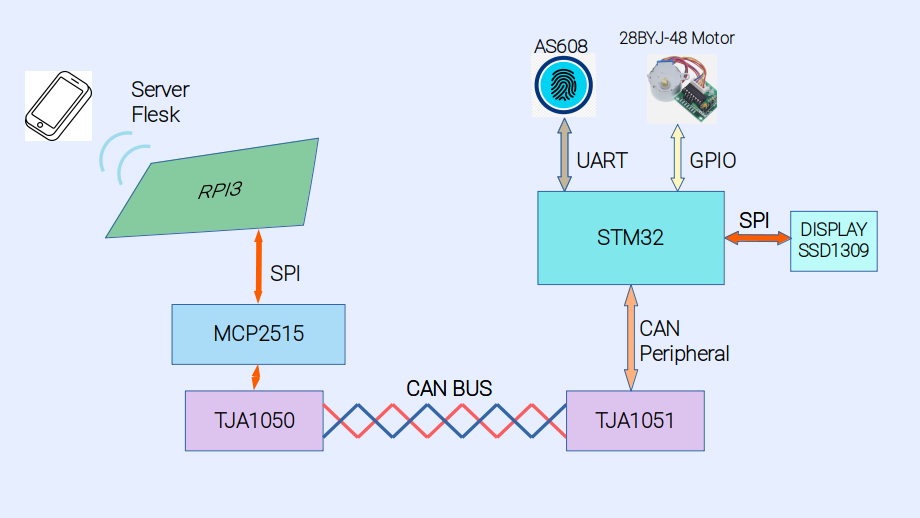
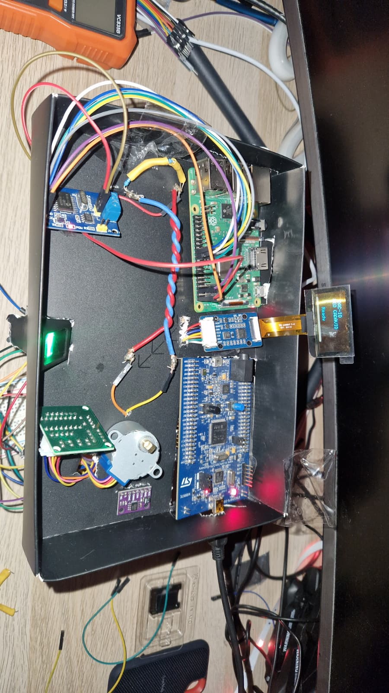

# DAC-IO – Embedded Access Controller

Embedded access control system based on STM32 and FreeRTOS.

The system integrates:
- Fingerprint authentication (AS608)
- CAN communication between STM32 and RPI
- Stepper motor door simulation (28BYJ-48)
- Transpartent OLED display interface (SSD1309)
- RTOS-based software architecture

---

## 📸 Project Overview

[Demo video](https://youtube.com/shorts/DQk252-6dWs?feature=share)

---

## 🚀 Features

- Biometric authentication
- Event-driven architecture
- Task-based design using FreeRTOS
- Modular driver structure
- CAN message integration
- Real-time motor control
- OLED event visualization

---

## 🧠 System Architecture

See detailed documentation:

- 📐 [Hardware Architecture](hardware.md)
- 🧩 [Software Architecture](software.md)

---

## 🎯 Design Philosophy

- Clear separation of layers
- RTOS task isolation
- Message-based communication
- Hardware abstraction through BSP

---

## 📌 Future Improvements

- Improve CAN protocol abstraction. More messages and capabilities for the system
- Improve the mobile app on RPI with better user interface 
- Make a specific circuit, making an easier hardware connectivity 
- Creating an specific door opening mecanism in substitution of the motor abstraction 
- Add persistent storage
- Improve error handling
- Add power management

---

## 👤 Author

Leopoldo Cadavid  
Embedded Systems Engineer
