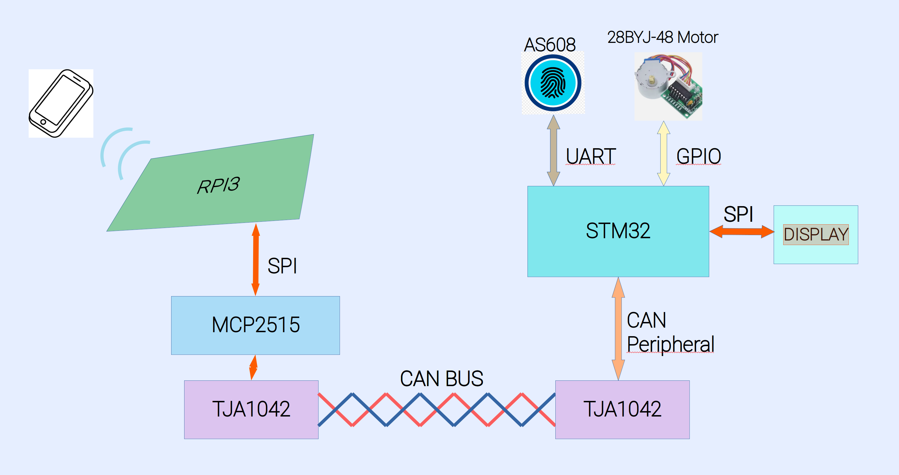

# Hardware Architecture

## 📦 Overview

This system is composed of:

- STM32 MCU
- AS608 fingerprint sensor
- 28BYJ-48 stepper motor
- Motor driver board
- SSD1309 OLED display
- CAN interface
- Raspberry PI 3 model B
- Module MCP2515 SPI to CAN
- TJA CAN Bus transceiver

---

## 🔌 Pin Configuration

### Fingerprint Sensor (AS608)

| Signal | STM32 Pin | Notes |
|--------|----------|------|
| TX     |          | UART |
| RX     |          | UART |
| VCC    |          |      |
| GND    |          |      |

---

### Stepper Motor (28BYJ-48)

| Signal | STM32 Pin | Notes |
|--------|----------|------|
| IN1    |          | GPIO |
| IN2    |          | GPIO |
| IN3    |          | GPIO |
| IN4    |          | GPIO |

---

### OLED Display (SSD1309)

| Signal | STM32 Pin | Interface |
|--------|----------|----------|
| SCL    |          | SPI/I2C  |
| SDA    |          | SPI/I2C  |
| CS     |          |          |
| DC     |          |          |

---

## 📐 Hardware Diagram

See diagrams in:

